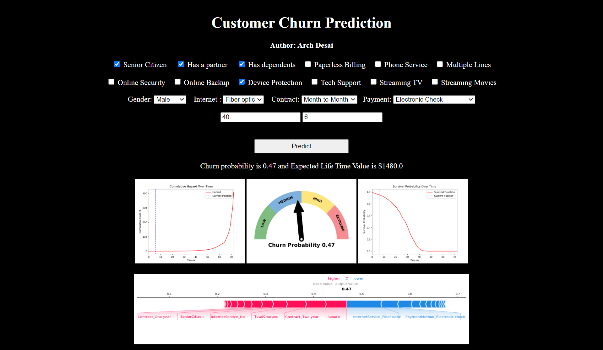

# 📊 Customer Churn Analysis & Prediction



## Overview

Customer churn is one of the most important business challenges in subscription-based industries. Understanding why customers leave and identifying high-risk customers enables organizations to improve retention strategies and increase long-term revenue.

This project combines Exploratory Data Analysis (EDA), Survival Analysis, Customer Lifetime Value estimation, and Machine Learning to analyze telecom customer behavior and predict customer churn.

The objective is to uncover key churn drivers, estimate customer retention probabilities, and develop a predictive model that supports data-driven business decisions.

---

## Business Problem

Acquiring new customers is significantly more expensive than retaining existing ones. Telecom companies often lose revenue when customers discontinue their services.

This project answers the following questions:

* Which customers are most likely to churn?
* What factors influence customer retention?
* How does churn behavior change over time?
* What is the expected customer lifetime value?
* How can businesses proactively reduce customer attrition?

---

## Dataset

**IBM Telco Customer Churn Dataset**

The dataset contains customer demographics, account information, service subscriptions, contract details, payment methods, and churn status.

### Key Features

* Customer Demographics
* Internet Services
* Contract Type
* Payment Method
* Monthly Charges
* Total Charges
* Customer Tenure
* Churn Status

---

## Tech Stack

### Programming

* Python

### Data Analysis

* Pandas
* NumPy

### Visualization

* Matplotlib
* Seaborn

### Machine Learning

* Scikit-Learn

### Survival Analysis

* Lifelines

### Explainable AI

* SHAP

### Deployment

* Flask

---

# 📈 Exploratory Data Analysis

The exploratory analysis focuses on understanding customer behavior patterns and identifying variables associated with customer churn.

## Customer Churn by Gender

<p align="center">

</p>

### Observation

Gender has minimal impact on customer churn and does not appear to be a strong predictive feature.

---

## Churn vs Customer Tenure

<p align="center">

</p>

### Observation

Customers with shorter tenure demonstrate significantly higher churn rates, while long-term customers tend to remain loyal.

---

## Monthly Charges Analysis

<p align="center">

</p>

### Observation

Customers with higher monthly charges exhibit a greater likelihood of churn.

---

## Contract Type Analysis

<p align="center">

</p>

### Observation

Month-to-month contracts experience the highest churn rates compared to one-year and two-year subscriptions.

---

# ⏳ Customer Survival Analysis

Survival Analysis helps estimate how long customers are likely to remain with the company before churn occurs.

## Kaplan-Meier Survival Curve

<p align="center">

</p>

### Key Insights

* Customer retention remains above 60% even after several years.
* Survival probability gradually decreases with customer tenure.
* Retention drops more rapidly after long periods of service.

---

## Survival Regression

The Cox Proportional Hazards Model was used to evaluate the impact of customer attributes on churn risk.

<p align="center">

</p>

This analysis helps identify which customer characteristics contribute most significantly to churn behavior.

---

## Customer Survival & Hazard Curves

<p align="center">


</p>

These visualizations estimate customer retention probability and churn risk over time.

---

# 🤖 Customer Churn Prediction

A Random Forest Classifier was developed to predict customer churn based on historical customer data.

## Machine Learning Workflow

1. Data Cleaning
2. Feature Engineering
3. Exploratory Analysis
4. Train-Test Split
5. Model Training
6. Hyperparameter Tuning
7. Model Evaluation

---

## Model Performance

| Metric   | Score |
| -------- | ----- |
| ROC-AUC  | 0.85  |
| F1 Score | 0.62  |

---

## Feature Importance

<p align="center">

</p>

The model identifies the most influential factors affecting customer churn.

---

# 🔍 Explainable AI

To improve model transparency and interpretability, SHAP values and feature importance techniques were applied.

## SHAP Analysis

<p align="center">

</p>

SHAP helps explain how individual features influence churn predictions.

---

# 💡 Business Recommendations

Based on the analysis:

* Encourage long-term contract adoption.
* Promote value-added services such as Online Security and Tech Support.
* Target new customers with retention campaigns.
* Monitor high-risk customers with elevated monthly charges.
* Provide personalized offers to customers likely to churn.

---

# 📁 Project Structure

```text
Customer-Churn-Analysis/
│
├── Exploratory Data Analysis.ipynb
├── Customers Survival Analysis.ipynb
├── Churn Prediction Model.ipynb
├── app.py
├── model.pkl
├── survivemodel.pkl
├── WA_Fn-UseC_-Telco-Customer-Churn.csv
│
├── Images/
├── static/
├── templates/
│
├── requirements.txt
└── README.md
```

---

# 🚀 Skills Demonstrated

* Data Cleaning
* Exploratory Data Analysis
* Statistical Analysis
* Data Visualization
* Survival Analysis
* Customer Analytics
* Machine Learning
* Predictive Analytics
* Explainable AI
* Business Intelligence

---

# 🔮 Future Improvements

* Interactive Power BI Dashboard
* Streamlit Deployment
* Advanced Ensemble Models
* Real-Time Churn Monitoring
* Automated Customer Risk Scoring

---

# 👩‍💻 Author

**Ananya Chaurasia**

Computer Science Engineering Graduate | Data Analytics Enthusiast

GitHub: [**ananyaintech**](https://github.com/ananyaintech)

---

### Note

This project is based on an open-source churn analysis implementation and has been enhanced with updated documentation, modernized visualizations, reproducible execution workflow, and portfolio-focused presentation.Contains all images
